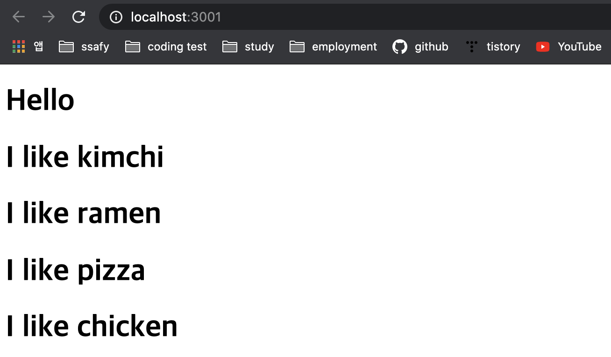

# Movie App (react-basic)

### React JS Fundamentals Course( 2019 Update! )

**#1 Check & Create My First React App**

```sh
node -v
npm -v
npx -v
git --version

npx create-react-app react-movie-app
cd react-movie-app
yarn start or npm start
```

**#2.1 Reusable Components with JSX + Props**

```sh
import React from 'react';

// function Food(props) {
//  console.log(props.fav); // kimchi
function Food({ fav }) {
  return <h1> I like {fav} </h1>;
}

function App() {
  return (
    <div>
      <h1> Hello </h1>
      <Food fav="kimchi" />
      {/* food component에 fav라는 이름의
      property를 kimchi라는 value로 준거야! */}
      <Food fav="ramen" />
      <Food fav="pizza" />
      <Food fav="chicken" />
    </div>
  );
}

export default App;
```


